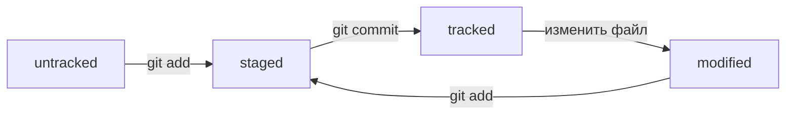

# git-hints

## Хеш

Хеш - это уникальный идентификатор коммита в Git.

По хешу Git может определить конкретный коммит и получить информацию о нём.

Хеш можно увидеть с помощью команды:

```bash
git log
```

Пример хеша:

```text
e83c5163316f89bfbde7d9ab23ca2e25604af290
```

Обычно для работы достаточно первых нескольких символов хеша, если они однозначно определяют коммит.

---

## Лог

Лог - это история коммитов репозитория.

Посмотреть историю репозитория можно командой:

```bash
git log
```

Для каждого коммита Git показывает основную информацию:
* хеш коммита;
* автора;
* дату создания;
* сообщение коммита.

Чтобы посмотреть историю коммита в сокращённом варианте, можно использовать:

```bash
git log --oneline
```

В этом случае каждый коммит будет напичатан в одну строчку: сокращенный хеш и ссобщение коммита.

---

## HEAD

`HEAD` - это указатель на текущий коммит, с которым мы работаем.

Обычно `HEAD` указывает на последний коммит текущей ветки.

Git хранит информацию о `HEAD` в файле:

```text
.git/HEAD
```

Посмотреть содержимое этого файла можно командой:

```bash
cat .git/HEAD
```

Через `HEAD` можно обращаться к текущему коммиту, не используя его полный хеш.

Например:

```bash
git show HEAD
```

покажет информацию о текущем коммите.

---

## Статусы файлов

Git отслеживает состояние файлов в репозитории. Посмотреть текущее состояние можно командой:

```bash
git status
```

Основные статусы файлов:

**untracked** - Git видит файл, но ещё не отслеживает его.

**tracked** - файл уже известен Git и был сохранён в репозитории.

**modified** - отслеживаемый файл был изменён после последнего коммита.

**staged** - изменения файла добавлены в область подготовленных файлов и попадут в следующий коммит.

Чтобы добавить файл в область подготовленных файлов:

```bash
git add README.md
```

Чтобы создать коммит:

```bash
git commit -m "Сообщение коммита"
```

Жизненный цикл файла можно представить так:



Получается:

```text
untracked + git add = staged
staged + git commit = tracked
tracked + изменение файла = modified
modified + git add = staged
```

---
